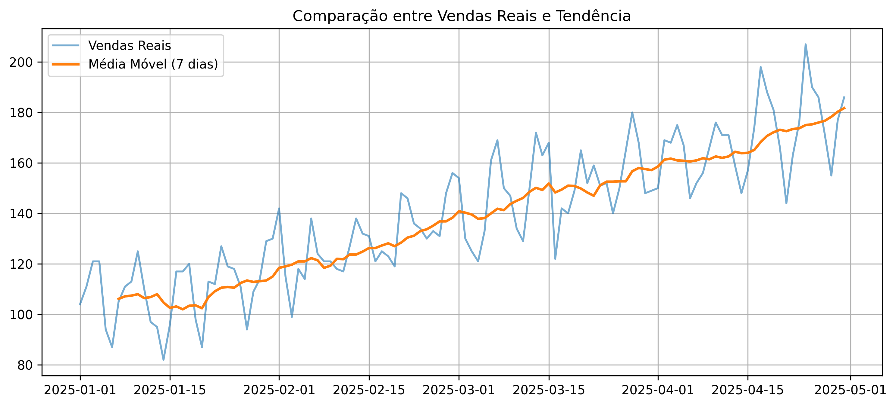
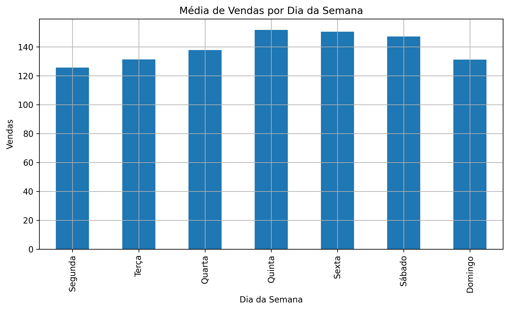

# Previsão de Demanda de Vendas

## Contexto

Este projeto simula uma demanda real da área de Planejamento e Abastecimento, com o objetivo de analisar dados históricos de vendas e apoiar decisões de negócio.

A proposta é reproduzir um cenário corporativo onde a área de dados atua como suporte à tomada de decisão, conectando análise técnica com impacto operacional.

---

## Objetivo

- Analisar o comportamento histórico das vendas  
- Identificar tendências e padrões de demanda  
- Aplicar uma abordagem inicial de previsão (baseline)  
- Gerar insights que apoiem decisões de negócio  

---

## Ferramentas Utilizadas

- Python  
- Pandas  
- NumPy  
- Matplotlib  

---

## Etapas do Projeto

1. Simulação de contexto corporativo  
2. Geração de dados realistas de vendas  
3. Análise exploratória (EDA)  
4. Aplicação de média móvel como baseline  
5. Identificação de padrão semanal (sazonalidade)  
6. Geração de insights de negócio  

---

## Principais Insights

- Identificação de tendência de crescimento nas vendas  
- Presença de sazonalidade semanal na demanda  
- Redução de ruído com uso de média móvel  
- Possibilidade de apoio a decisões como:
  - planejamento de estoque  
  - reposição de produtos  
  - organização logística  

---

## Valor para o Negócio

A análise permite uma visão estruturada da demanda, contribuindo para:

- maior previsibilidade operacional  
- melhor planejamento de compras  
- base para evolução de modelos preditivos  

---

## Notebook

A análise completa está disponível em:

`notebooks/01_previsao_demanda_vendas.ipynb`

## Visualizações

---

## Próximos Passos

- Implementação de modelos mais avançados (ARIMA, regressão)  
- Inclusão de variáveis externas (promoções, feriados)  
- Avaliação de métricas de erro  

---

##   Autor

Jairo Costa  
